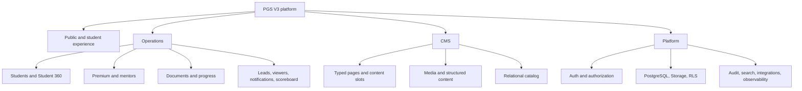

# Canonical PGS V3 architecture overview

Status: **Phase 2 architecture freeze**

Baseline: `project-mtfbwu/pgs-v3`, branch `agent/full-site-migration`, commit `8b59c71968277eb27ff26f64707d825d906a9e2a`

Legacy evidence: `project-mtfbwu/purpleguide@fcca51b0db31bf5c59a4b4f00f0bd12b77fb0470`

This specification converts the Phase 1 audit in `docs/pgs-v3-audit/` into the target engineering contract. It does not authorize frontend, feature, dependency, migration, Storage, Supabase data, or Figma changes.

## Canonical platform

CMS and Operations may share one secured Next/Supabase application, but their domain contracts, permissions, data ownership, and navigation remain distinct.

## Frozen principles

1. Figma/Flow own presentation and navigation; the current generated dashboard is not approved design truth.
2. One Supabase Auth user can participate through relational contexts: student profile, staff assignment, and/or Student Viewer relationship. Authorization is never a client-controlled actor label.
3. Premium is an entitlement on a student, not an identity or application workflow.
4. Authorization is the conjunction of global permission, ownership/relationship scope, entitlement where applicable, and resource state.
5. Student 360 is an aggregate/read model over authoritative domains, not a giant duplicate table.
6. One student has one board dataset; student and staff renderers remain separate.
7. Documents are logical business records with immutable versions. File security and business workflow are independent.
8. No normal preview/download/signed URL may be issued unless the version security state is `clean`.
9. Student Viewer is a scoped relationship with explicit capability grants; document access also requires an explicit document share.
10. CMS uses typed approved content slots; catalog and operations remain relational.
11. Search, analytics, notifications, and AI consume permission-shaped server/database contracts, never unrestricted service-role reads.
12. Migrations 001–009 remain immutable; any future schema change starts at 010+.

## Four product layers

| Layer | Canonical owner | Stored as | Prohibited shortcut |
|---|---|---|---|
| Page design/structure | approved Figma + page-specific Next components | code and design references | generic page builder or invented student layout |
| CMS content | editorial staff through revisioned schemas | typed revisions/structured content/media references | arbitrary layout JSON |
| Catalog/operations | domain services and relational Postgres | normalized tables with constraints | anonymous content blobs |
| User/relationship state | Auth, entitlements, assignments, relationships, ownership | canonical rows + RLS + server authorization | UI-only checks or mutable user metadata roles |

## Decision record: Premium is an entitlement

| Field | Record |
|---|---|
| Context | Legacy `purplepremium_applications` encoded an owner-rejected application/approval workflow. |
| Options | identity role; separate account; entitlement; preserve legacy application |
| Decision | Keep `premium_entitlements` plus append-only `premium_entitlement_events`; purchase activates automatically and Admin/Super Admin may grant/revoke/reactivate. |
| Why | Matches owner truth and the existing secure V3 model in migration `202608130003_premium_workspace.sql`. |
| Tradeoffs | Every Premium resource must resolve current entitlement; historical access behavior requires explicit policy. |
| Existing evidence | `src/lib/student-experience.ts`, `src/lib/premium-workspace.ts`, migration 003 and hardening migration 007. |
| Reference evidence | Supabase Auth/RLS separates authentication from row-level authorization. |
| Reversibility | Data model is reversible through events; returning to application semantics is not approved. |
| Implementation phase | Existing foundation retained; hardening in Phase 3+ after gates. |

## Decision record: Figma implementation gate

| Field | Record |
|---|---|
| Context | PGS Flow, Figma V6, and V6 Popup were inaccessible at file/page/frame/node level in Phase 1 and remain inaccessible. |
| Options | infer UI; use generated V3; use legacy alone; block presentation |
| Decision | **BLOCKED — FIGMA ACCESS REQUIRED.** No frontend recovery or new student layout begins before exact design evidence is readable. |
| Why | Owner authority explicitly forbids Codex-designed product presentation. |
| Tradeoffs | Backend/domain work can advance; presentation recovery waits. |
| Existing evidence | `docs/pgs-v3-audit/02-figma-route-state-map.md`. |
| Reference evidence | Not applicable; product authority controls. |
| Reversibility | Gate can be cleared by supplying verified source identifiers and access. |
| Implementation phase | Required before Phase 3 frontend recovery. |

## Decision index

| Decision | Canonical document |
|---|---|
| Viewer as relationship; explicit grants | `06-student-viewer-relationship-model.md` |
| Global staff Viewer renamed `read_only_staff` | `04-identity-rbac-permission-model.md` |
| Document dual status and clean gate | `08-document-domain-and-security-lifecycle.md` |
| Uppy Core; TUS deferred | `09-storage-and-upload-architecture.md` |
| shadcn staff boundary, tables/forms/editor/charts/search UI | `13-framework-adoption-plan.md` |
| Postgres-first search | `12-scoreboard-search-analytics-model.md` |
| Migration 010+ sequence | `15-migration-strategy.md` |

Unresolved product policy is isolated in `17-owner-decisions-required.md`; no unresolved choice is silently encoded here.
