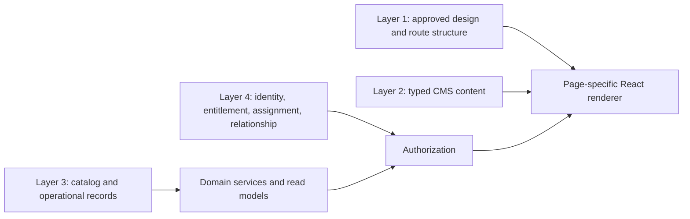

# Canonical domain boundaries

## Bounded domains

| Domain | Owns | Does not own | Current evidence |
|---|---|---|---|
| Auth | session and credential identity | staff role, Premium, Viewer scope | Supabase Auth; server clients |
| Students | student profile and study preferences | staff identity, entitlement history | `profiles`, migration 002 |
| Staff access | staff lifecycle, roles, permission assignments | student relationships or Premium | `staff_profiles`, `staff_roles`, `staff_role_assignments`, migration 004 |
| Premium | current entitlement and immutable entitlement events | identity class/application approval | migration 003/007 |
| Mentors | assignment lifecycle | global student access | `mentor_assignments`, migration 003/009 |
| Viewer access | per-student relationship, grants, explicit shares | global staff RBAC | target new domain |
| Student workspace | profile summary, selections, comments, review queue, notes, alerts | source identity, catalog records | migration 003 |
| Progress | board columns, tasks, milestones/workflow state | UI layout | `student_board_columns`, `student_tasks` |
| Documents | requirements, logical records, versions, scans, reviews, previews, shares | raw public paths, generic folders | current requirement/version foundation + target entities |
| Catalog | countries, universities, programs, courses, events, tags/facets | page layout, student selections | migration 001 public-site |
| CMS/content | page revisions, slots, reusable editorial modules, media metadata | operational/student state | migrations 001, 004, 005 |
| Leads | canonical lead, source submissions, assignment, conversion, notes | student profile source of truth | existing source tables + target lead aggregate |
| Notifications | in-app notification projection and channel delivery | originating business transaction | `notifications`, target domain events/deliveries |
| Audit | immutable privileged/security change evidence | end-user activity feed copy | existing admin/premium audit tables, target consolidation |
| Search | permission-aware indexes/queries | authorization decisions | current public search + target server search service |
| Analytics | defined measures/read models/snapshots | manually entered dashboard totals | target SQL views/functions/snapshots |
| Integrations | provider outbox/delivery adapters | domain state | `private.integration_outbox` |

## Four-layer separation

Page renderers may combine outputs but cannot take ownership of the underlying rules. CMS content may populate approved slots but cannot create layout. Operational records may be referenced by CMS, not copied into page JSON.

## Cross-domain contracts

- Premium activation emits a domain event; the notification domain may project it into an in-app record.
- Mentor assignment grants scope only when the actor also has the relevant staff permission and active staff status.
- Viewer relationship grants scope only when active; a permission grant selects a data class; a document share selects an individual document.
- Document review updates workflow state only; scan services update security state only.
- Student university selections reference catalog universities and own their application stage.
- Student 360 coordinates domain read models but writes through each owning domain service.
- Search and analytics query allowlisted permission-shaped views; they never become alternate data authorities.

## Lifecycle ownership

| Lifecycle | Authoritative domain | Required event/audit |
|---|---|---|
| student signup/profile completion | Students | identity/profile events as policy requires |
| Premium purchase/grant/revoke/reactivate/expire | Premium | entitlement event + privileged audit where actor exists |
| mentor assign/end | Mentors | domain event + privileged audit |
| Viewer invite/accept/revoke/expire | Viewer access | relationship event + privileged audit for staff action |
| document upload/scan/review/share/archive | Documents | domain event; privileged actions also audit |
| lead intake/assign/status/convert | Leads | source attribution + domain event + audit for staff changes |
| CMS/catalog publish | CMS/Catalog | immutable revision/publication audit |
| notification delivery | Notifications/Integrations | delivery attempt state; no mutation of source event |

## Prohibited coupling

- No `is_premium` or role value in client storage as authority.
- No mentor/student/viewer scope inferred from a route ID.
- No document authorization from Storage path parsing alone.
- No lead conversion by copying profile data without a stable link.
- No page content JSON containing authoritative universities, tasks, entitlements, permissions, or document state.
- No analytics table manually edited to match a dashboard number.
- No external notification provider call inside the core domain transaction.
