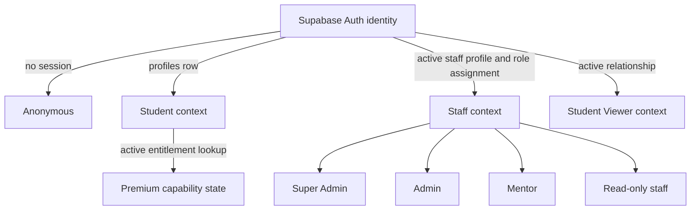

# Identity, RBAC, and permission model

## Canonical actors



Premium is not an actor. Student Viewer is not a staff role. Actor context is selected and verified per request.

### Decision record: relational actor contexts

| Field | Record |
|---|---|
| Context | One Auth user may legitimately be a student, staff member, or Viewer; current signup trigger creates `profiles` for every Auth user. |
| Options | one mutable actor-type column; separate accounts; relational contexts |
| Decision | One Auth identity with authorization contexts derived from student profile, active staff role assignment, and active Viewer relationship rows. Harden provisioning so Viewer-only invitations do not accidentally grant student context. |
| Why | Avoids duplicate identities and preserves explicit resource scope. |
| Tradeoffs | Every request selects/validates context; multi-context navigation needs an approved product design. |
| Existing evidence | `auth.users`, `profiles`, `staff_profiles`/assignments, target Viewer relationships. |
| Reference evidence | Supabase Auth identity plus Postgres/RLS relational authorization. |
| Reversibility | A future account-context projection can cache derived membership without replacing source rows. |
| Implementation phase | Access foundation before Viewer account creation. |

## Canonical role naming

The current global role key `viewer` becomes **`read_only_staff`**. Migration 010+ must add the new key, copy active assignments/role-permission joins, update compatibility code/functions, verify, and only then retire the old key. UI labels may say “Read-only staff.”

### Decision record: global staff Viewer naming

| Field | Record |
|---|---|
| Context | Migration 004 uses global `viewer`; owner introduces a per-student Viewer relationship. |
| Options | keep ambiguous `viewer`; `operations_viewer`; `read_only_staff` |
| Decision | `read_only_staff`. |
| Why | Describes global staff membership and cannot be confused with a student relationship. |
| Tradeoffs | Requires compatibility migration and tests across DB functions, TypeScript maps, fixtures, and UI copy. |
| Existing evidence | `staff_roles`, `staff_role_assignments`, `staff_student_directory`, `src/lib/staff-auth.ts`. |
| Reference evidence | RBAC role names should reflect organizational scope; relationship authorization remains separate. |
| Reversibility | Old key can remain as a temporary alias; no destructive rename first. |
| Implementation phase | Migration 010+ before Student Viewer ships. |

## Canonical staff permission catalog

Permissions are domain-oriented operations. Scope is a separate predicate, not encoded by proliferating `_all` permission names.

| Domain | Permission keys |
|---|---|
| Overview/analytics | `overview.read`, `scoreboard.read` |
| Students | `students.read`, `students.update` |
| Progress/tasks | `student_progress.read`, `student_progress.update`, `student_tasks.read`, `student_tasks.manage` |
| Documents | `student_documents.read`, `student_documents.upload`, `student_documents.review`, `student_documents.manage` |
| Comments/notes/alerts | `student_comments.read`, `student_comments.write`, `student_notes.read_private`, `student_notes.write`, `student_alerts.manage` |
| Premium/mentors/Viewers | `premium.read`, `premium.manage`, `mentor_assignments.read`, `mentor_assignments.manage`, `viewer_relationships.read`, `viewer_relationships.manage` |
| Catalog | `catalog.read`, `catalog.manage`, `catalog.publish` |
| CMS/content/media | `cms.read`, `cms.manage`, `cms.publish`, `content.read`, `content.manage`, `content.publish`, `media.read`, `media.manage` |
| Leads | `leads.read`, `leads.manage` |
| Notifications | `notifications.read`, `notifications.manage` |
| Staff/system | `staff.read`, `staff.manage`, `audit.read`, `settings.read`, `settings.manage` |

Current `student_workspace.*`, `roles.manage`, and other migration-004 keys receive an explicit compatibility map; they are not silently removed.

## Staff role mapping

| Role | Baseline permissions | Additional scope predicate |
|---|---|---|
| `super_admin` | all approved staff permissions | global; protected role-governance safeguards still apply |
| `admin` | operational read/manage/publish; `staff.read`; not `staff.manage` unless owner grants | global operational scope |
| `mentor` | student/progress/tasks/documents/comments/private notes/alerts permissions required for approved workflow | active assignment to target student |
| `read_only_staff` | overview/scoreboard, students, student domain, catalog/CMS/content/media/leads/settings read only | global read-only; field minimization still applies |

### Explicit baseline permission map

`✓` means the role receives the global operation permission; `assigned` means the permission is usable only for an actively assigned student. Owner decisions may further narrow mentor mutations but cannot broaden assignment scope.

| Permission group | Super Admin | Admin | Mentor | Read-only staff |
|---|---:|---:|---:|---:|
| `overview.read`, `scoreboard.read` | ✓ | ✓ | ✓ | ✓ |
| `students.read` | ✓ global | ✓ global | assigned | ✓ global minimized |
| `students.update` | ✓ global | ✓ global | — | — |
| `student_progress.read`, `student_tasks.read` | ✓ global | ✓ global | assigned | ✓ global minimized |
| `student_progress.update`, `student_tasks.manage` | ✓ global | ✓ global | assigned | — |
| `student_documents.read` | ✓ global | ✓ global | assigned | ✓ global minimized |
| `student_documents.upload` | ✓ global | ✓ global | — by default | — |
| `student_documents.review` | ✓ global | ✓ global | assigned | — |
| `student_documents.manage` | ✓ global | ✓ global | — | — |
| `student_comments.read`, `student_comments.write` | ✓/✓ | ✓/✓ | assigned/assigned | read only minimized |
| `student_notes.read_private`, `student_notes.write` | ✓/✓ | ✓/✓ | assigned/assigned | — |
| `student_alerts.manage` | ✓ | ✓ | assigned | — |
| `premium.read`, `premium.manage` | ✓/✓ | ✓/✓ | assigned read only | read only |
| `mentor_assignments.read`, `mentor_assignments.manage` | ✓/✓ | ✓/✓ | own read only | read only |
| `viewer_relationships.read`, `viewer_relationships.manage` | ✓/✓ | ✓/✓ | — by default | read only minimized |
| catalog/CMS/content/media read/manage/publish | all | all | `media.read` only unless approved | read only |
| `leads.read`, `leads.manage` | ✓/✓ | ✓/✓ | — | read only |
| `staff.read`, `staff.manage` | ✓/✓ | read only/— | own profile only | read only |
| `audit.read` | ✓ | ✓ | — | — by default |
| `settings.read`, `settings.manage` | ✓/✓ | ✓/✓ | — | read only |

The database permission catalog is canonical. TypeScript may expose generated keys/types but must not maintain an independent grant matrix.

Student ownership and Viewer grants do not use staff permission rows. Student Viewer capability keys are defined in `06-student-viewer-relationship-model.md`.

## Authorization equation

```text
ALLOW = authenticated actor
    AND account/status valid
    AND operation permission or student ownership rule
    AND resource scope predicate
    AND entitlement predicate when the product requires Premium
    AND resource security/lifecycle predicate
```

Examples:

- Mentor document read = active staff + `student_documents.read` + active assignment + active Premium policy + clean version.
- Viewer document read = authenticated viewer + active relationship + `shared_documents.read` grant + active explicit share + clean version.
- Student task read = own student ID + active Premium if workspace is Premium-gated.
- Admin entitlement revoke = active staff + `premium.manage`; reason/audit rules still apply.

## Three student states

`resolveStudentExperience()` in `src/lib/student-experience.ts` is **KEEP + HARDEN**. Its state contract remains:

```text
no authenticated user → anonymous
authenticated student + no active entitlement → authenticated_standard
authenticated student + active unexpired entitlement → authenticated_premium
```

The resolver is presentation-independent. Generated dashboard/shell markup remains rejected as design authority and blocked behind Figma verification.
