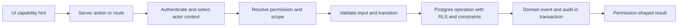

# RLS and authorization matrix

## Enforcement layers

UI controls are advisory. Server authorization is mandatory, and RLS/constraints are the defense-in-depth boundary. Any service-role operation authorizes first and uses a narrowly scoped domain service.

## Actor/resource matrix

| Resource | Anonymous | Student | Mentor | Read-only staff | Admin | Super Admin | Student Viewer |
|---|---|---|---|---|---|---|---|
| published CMS/catalog | read | read | read | read drafts with permission | manage/publish by permission | manage/publish | published read |
| own profile/saves/notifications | none | own CRUD per policy | none unless assigned safe projection | minimized read | permitted | permitted | none unless separately granted field projection |
| Premium entitlement | none | own read | assigned read | permitted read | manage | manage | none by default |
| mentor assignment | none | own read | own active assignments | read | manage | manage | none |
| workspace/profile/progress/tasks | none/approved teaser only | own, entitlement-gated | assigned + permission | read-safe projection | manage by permission | manage | linked student + explicit capability only |
| private notes | none | student-visible only | assigned + private-note permission | only if explicitly permitted | permitted | permitted | never |
| document metadata | none | own | assigned + permission | permission-shaped read | permissioned | permissioned | linked + grant + explicit share |
| document bytes/preview | none | own clean version | assigned clean version | clean + permission | clean + permission | clean; quarantine only through separate security operation | clean + active explicit share |
| Viewer relationships | none | owner-decision scope | read only if approved; no manage by default | read if permissioned | manage | manage | own relationship summary only |
| leads | none except create validated submission | no internal read | none by default | read | manage | manage | none |
| staff/roles | none | none | own profile | staff read if granted | staff read | manage | none |
| audit | none | own domain-visible activity, not audit | no audit by default | audit only if explicitly granted | audit read | audit read | no audit |
| scoreboard | public approved stats only | own product summaries | assigned cohort | authorized aggregate | aggregate/drill-down by permission | yes | no internal scoreboard |

## Predicate ownership

| Rule | DB RLS | Constraint/trigger | Server domain authorization | UI |
|---|---:|---:|---:|---:|
| current authenticated identity | yes | — | yes | state only |
| active staff status/permission | helper predicate | role assignment uniqueness/lifecycle | yes | hide/disable |
| student owns row | yes | FK consistency | yes for service-role paths | reflect |
| active mentor assignment | yes | one-active/lifecycle checks | yes | reflect |
| active Viewer relationship/grant | yes | lifecycle/unique/check constraints | yes | reflect |
| explicit document share | yes | same-student/share lifecycle | yes | reflect |
| active Premium entitlement | yes where product rule requires | state checks | yes | lock state |
| document `clean` security state | Storage/metadata select where practical | transition control | mandatory before signing/proxy | status only |
| workflow transition | write policy may limit actor | transition function/checks | mandatory | available actions |
| privileged audit actor/reason | insert controlled | append-only trigger | mandatory | collect reason |

## RLS helper contract

Future helpers remain in `private`, `SECURITY DEFINER`, fixed empty `search_path`, revoked from `public/anon`, and granted only where required:

- `private.has_staff_permission(permission_key)` — canonical DB permission truth.
- `private.is_active_mentor(student_id)` — permission plus active assignment.
- `private.has_active_premium(student_id)` — status/expiry-aware.
- `private.has_active_viewer_relationship(student_id, capability)` — current user + active relationship + explicit active grant.
- `private.can_read_document(document_id)` — ownership/staff/mentor/viewer scope plus clean current/requested version.
- `private.can_manage_student(student_id, permission)` — staff permission plus global/assignment scope.

Avoid a single broad `can_access_student` helper that makes every domain equally visible.

## Storage and signed URL rules

- Quarantine bucket has no ordinary student/mentor/Viewer select policy.
- Clean source and preview buckets require an existing clean version plus actor-specific metadata authorization.
- Service-generated signed URLs are issued only after the same checks; bucket access alone is not sufficient.
- Short TTL limits exposure; access/share/revoke events are recorded.
- Original filename never participates in authorization or object path selection.

## Required runtime fixtures

At minimum: anonymous; standard student A/B; Premium student A/B; mentor assigned A and unassigned B; active/suspended staff; `read_only_staff`; Admin; Super Admin; Viewer active/revoked/expired; capability present/absent; shared/unshared document; clean/infected/scan-failed version. Test SELECT and every mutation directly through PostgREST/RPC plus server routes. Static policy inspection is not a runtime RLS pass.
