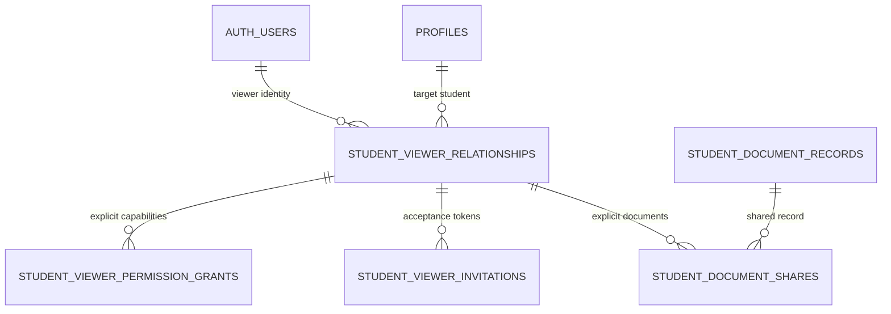

# Student Viewer relationship model

Student Viewer covers parent, guardian, teacher, or other read-only access to one student. It is not a staff role and grants nothing globally.

## Relationship model



### `student_viewer_relationships`

| Field | Contract |
|---|---|
| `id` | UUID primary key |
| `student_id` | required FK `profiles(id)` |
| `viewer_user_id` | nullable while invited; required for active/revoked accepted relationship |
| `relationship_type` | `parent`, `guardian`, `teacher`, `other` |
| `status` | `invited`, `active`, `revoked`, `expired` |
| `invited_by`, `invited_at` | actor and time |
| `accepted_at` | required exactly when accepted/active history exists |
| `expires_at` | optional time limit; crossing it makes authorization false and lifecycle worker marks expired |
| `revoked_by`, `revoked_at`, `reason` | required together for revoked status |
| `created_at`, `updated_at` | explicit lifecycle timestamps |

Checks enforce coherent status/timestamps. A partial unique index prevents more than one active relationship for the same `(student_id, viewer_user_id, relationship_type)`; exact duplicate policy remains owner-configurable.

### Invitation secrets

`private.student_viewer_invitations` stores `relationship_id`, normalized invite destination, one-way token hash, expiry, consumed/failed timestamps, attempt count, and delivery correlation. Raw tokens are never stored. Acceptance authenticates or creates a normal Supabase identity, verifies the token, binds `viewer_user_id`, consumes the invite once, and writes relationship/domain/audit events.

## Capability storage decision

Choose **explicit normalized permission rows**:

`student_viewer_permission_grants(relationship_id, permission_key, granted_by, granted_at, revoked_by, revoked_at, reason)`

Initial allowlist:

- `progress.read`
- `milestones.read`
- `academic_status.read`
- `shareable_comments.read`
- `shared_documents.read`

Permission definitions may be seeded reference rows. Relationship-type presets are UI/domain-service templates only; authorization reads explicit grants. A Boolean `can_view_everything`, unconstrained JSON/array, or role-based global Viewer permission is prohibited.

### Decision record: Viewer as relationship with explicit grants

| Field | Record |
|---|---|
| Context | Owner requires student-specific, granular, revocable Viewer access. |
| Options | staff role; Boolean; permission JSON/array; predefined profiles only; explicit relational grants |
| Decision | Active relationship + explicit relational grant rows; explicit document share for each document. |
| Why | Straightforward RLS `exists` predicates, indexed lookup, actor/timestamp audit, and no hidden permission blob. |
| Tradeoffs | More rows and management UI; presets require expansion into grants. |
| Existing evidence | No current table; current global `viewer` proves why semantics must be separated. |
| Reference evidence | Supabase RLS supports relationship `exists` policies; row-level joins are transparent and testable. |
| Reversibility | Grants can later be generated from profiles without changing authorization meaning. |
| Implementation phase | Migration 010+ and server/RLS slice before Viewer frontend. |

## Authorization invariant

```text
Viewer allow = auth.uid() = relationship.viewer_user_id
  AND relationship.student_id = target.student_id
  AND relationship.status = active
  AND relationship not expired
  AND active grant exists for requested data class
  AND resource-specific predicate passes
```

For documents, the final predicate additionally requires an active `student_document_shares` row for that relationship and record, plus a clean requested/current version. The broad `shared_documents.read` grant never shares every student document.

## Allowed and denied projections

| Data | Baseline Viewer rule |
|---|---|
| progress/milestones/academic status | only explicit grant; fields are allowlisted per read model |
| shareable comments | grant + `viewer_shareable` visibility; never private notes |
| document metadata/version/preview | grant + explicit active share + clean version; version breadth/download is owner decision |
| student identity | minimal display fields needed to identify the relationship; no unrestricted profile |
| private mentor/admin notes | always denied |
| auth/staff/audit administration | always denied |
| other students/unshared documents | always denied |
| writes | denied; Viewer is read-only |

## Lifecycle events

`viewer.invited`, `viewer.invite_accepted`, `viewer.permission_granted`, `viewer.permission_revoked`, `viewer.document_shared`, `viewer.document_unshared`, `viewer.revoked`, `viewer.expired`, and authorized document access events. Events contain IDs and safe metadata, not invite tokens or unnecessary PII.

## Required negative tests

- Viewer A/Student A cannot read Student B even with a forged route ID.
- Active relationship without capability returns no protected rows.
- Capability without document share returns no document.
- Share for a different relationship/student fails the FK/constraint.
- Revoked/expired relationship or grant/share immediately returns no rows.
- Viewer cannot insert/update/delete records or Storage objects.
- Viewer cannot read pending/scanning/infected/rejected/scan-failed versions.
- A signed URL endpoint repeats authorization; previously issued URL behavior is bounded by short TTL.

Who may invite/manage, age/consent rules, default grants, expiry defaults, download/watermark policy, and Premium-revocation effects remain in `17-owner-decisions-required.md`.
