# Student 360 aggregate model

Student 360 is a permission-shaped application aggregate. It is not a table and does not duplicate every student domain.

## Decision record: aggregate/read model, not table

| Field | Record |
|---|---|
| Context | Operations needs one student workspace across many existing normalized domains. |
| Options | giant `student_360` table/JSON; client-side joins; permission-shaped server aggregate with targeted tabs |
| Decision | Server coordinator plus bounded SQL views/functions and per-domain tab queries; no duplicate giant table. |
| Why | Preserves ownership/RLS, avoids drift, and prevents loading every private domain for each screen. |
| Tradeoffs | More explicit read contracts and orchestration; counts may require measured projections. |
| Existing evidence | current staff student workspace and `loadPremiumWorkspace()` aggregate normalized tables. |
| Reference evidence | record-detail/read-model patterns from mature internal tools/CRM architecture. |
| Reversibility | Individual read models can change without data migration. |
| Implementation phase | Backend read-model slices; presentation remains Figma-gated. |

```mermaid
flowchart TB
  S360["Student 360 coordinator"]
  S360 --> ID["profiles and study preferences"]
  S360 --> PREM["Premium entitlement and events"]
  S360 --> REL["mentor and Viewer relationships"]
  S360 --> CAT["saves and university selections"]
  S360 --> PROG["progress, milestones, board, tasks"]
  S360 --> DOC["documents, versions, reviews, shares"]
  S360 --> COLLAB["comments, notes, alerts, review queue"]
  S360 --> N["notifications"]
  S360 --> LEAD["lead attribution and conversion link"]
  S360 --> ACT["permission-shaped domain activity"]
  S360 --> AUD["privileged audit, separate permission"]
```

## Authoritative entities

| Student 360 section | Authority | Status/action |
|---|---|---|
| identity/contact/study preferences/destination | `profiles` | KEEP; column-minimized by actor |
| Premium | `premium_entitlements`, `premium_entitlement_events` | KEEP |
| mentor | `mentor_assignments`, `staff_profiles` | KEEP |
| Viewers | target relationships, grants, invitations, document shares | NEW |
| saved programs/courses | `saved_programs`, `saved_courses` + catalog | KEEP |
| universities/application stage | `student_university_selections` + `universities` | KEEP |
| progress/milestones | workspace profile and target milestone definitions/instances where evidence requires | PARTIAL; owner decision on milestone schema |
| tasks/Kanban | `student_board_columns`, `student_tasks` | KEEP, one board |
| requirements/documents/versions/reviews | document domain | ALTER/NEW per architecture |
| comments | `workspace_comments` | ALTER for document link/viewer visibility |
| mentor/admin notes | `counselor_notes` | KEEP + HARDEN |
| notifications | `notifications` | KEEP + link event |
| lead/source/conversion | target `leads.converted_student_id` + source submissions | NEW/ALTER |
| user-facing activity | permission-shaped `domain_events` | NEW |
| privileged audit | `audit_events` | MERGE/ALTER; separate permission |

## Loading contract

1. `getStudent360Summary(actor, studentId)` authenticates and resolves scope once.
2. It returns only header-level identity, entitlement, active mentor, safe status, and section counts/capabilities.
3. Each tab/panel calls a targeted domain query with the resolved actor context or re-authorizes through the shared service.
4. Documents/activity/comments use cursor pagination; no signed URLs are generated for list rows.
5. Private notes, Viewer relationships, audit, and lead attribution are separate permissioned queries.
6. Mutations call the owning domain service and return canonical changed data/event identifiers; the coordinator never writes tables directly.

## Proposed read contracts

| Contract | Contents | Actors |
|---|---|---|
| `student_360_summary` | minimal profile, entitlement, mentor, counts, capabilities | student own; assigned mentor; permitted staff; Viewer receives separate reduced contract |
| `student_360_progress` | workspace/progress/tasks/milestones | actor-shaped |
| `student_360_documents` | document summaries only | actor-shaped; Viewer explicit shares only |
| `student_360_collaboration` | permitted comments/reviews/notes/alerts | never merge private notes into Viewer projection |
| `student_360_relationships` | mentor and Viewer lifecycles | students/roles per owner policy; Admin manage |
| `student_360_activity` | safe domain events | visibility filtered |
| `student_360_audit` | privileged before/after events | `audit.read` only |

Implement as server query services and SQL functions/views where joins and RLS benefit. Avoid one `SECURITY DEFINER` mega-function returning all data. Each function has fixed `search_path`, explicit column list, bounded parameters, and authorization predicates.

## Performance constraints

- one auth/actor-context resolution per request boundary;
- no entire aggregate load for one tab;
- no N+1 actor/catalog/document lookups;
- summary counts computed with indexed aggregates or maintained projections only when measured;
- stable cursor keys `(created_at, id)` or domain equivalent;
- do not cache private aggregates across users/roles;
- lazy-load heavy document preview, activity, and notes.

## Write examples

- Mentor moves a task through `progressService.moveTask`; same `student_tasks` row updates the student board.
- Admin reviews a version through `documentsService.recordReview`; document workflow, event, audit, and notification projection are coordinated transactionally.
- Admin grants Viewer capability through `viewerAccessService`; explicit relationship grant and event are written, not a Student 360 JSON field.
- Premium purchase calls the entitlement service; central student state changes on the next authoritative resolution.

## Security rule

Student 360 convenience cannot broaden access. Every subsection is the intersection of actor permission/scope and field visibility. A mentor assigned to Student A cannot enumerate Student B; a Viewer linked to A cannot load staff notes, audit, or unshared documents; `read_only_staff` receives read-only minimized projections.
