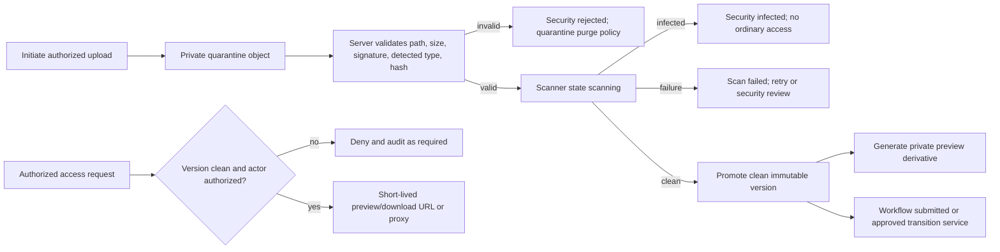

# Document domain and security lifecycle

## Domain entities

| Entity | Responsibility |
|---|---|
| requirement | what PGS requests and whether it is open/satisfied/waived/cancelled |
| document record | stable student-owned business identity, category/type/title, workflow, current version |
| document version | immutable uploaded bytes metadata, security state, uploader, hash/path |
| review | immutable decision/feedback on a version |
| preview | private derived representation and generation state |
| comment | threaded collaboration linked through `workspace_comments.document_id` |
| share | relationship-specific read permission to logical document |
| domain event | activity source; safe document activity view |

## Independent lifecycle state

### Upload session state

`initiated → uploading → uploaded → finalized` with terminal `failed` or `expired`. Pending upload belongs to the upload session, not an immutable version.

### File security state on a version

`uploaded → scanning → clean` or terminal `infected`, `rejected`, `scan_failed`.

- `infected`: scanner positively detected unsafe content.
- `rejected`: validation/policy rejection, including unsupported or malformed file.
- `scan_failed`: infrastructure/indeterminate failure; retry may create a new scan attempt/state transition without treating the object as clean.

### Business workflow state on a logical document

`submitted → in_review → needs_changes → submitted` or `approved`, `rejected`, `archived` according to authorized transitions. A new clean version may return `needs_changes`/`rejected` work to `submitted`; review history remains immutable.

Requirement fulfillment is separate: `open`, `satisfied`, `waived`, `cancelled`. It may be derived/transitioned from the approved current document but is not the document workflow column.

### Decision record: dual-status model

| Field | Record |
|---|---|
| Context | Current `student_documents.qc_status` and `scan_status` are separate but limited; requirement status also overlaps workflow. |
| Options | one status; security + workflow; security + workflow + requirement fulfillment/upload session |
| Decision | Separate upload-session, version-security, document-workflow, and requirement-fulfillment lifecycles. |
| Why | Each has different actor, transition, access effect, and audit meaning. |
| Tradeoffs | More explicit services/columns and migration mapping; substantially fewer impossible/unsafe states. |
| Existing evidence | migration 003, document APIs, legacy `user_documents`/additional types. |
| Reference evidence | OWASP upload guidance separates validation/scanning from application approval. |
| Reversibility | Compatibility views can expose old `qc_status` during cutover. |
| Implementation phase | Migration 010+ document foundation before new workspace UI. |

## Upload, scan, preview, and access lifecycle

## Clean access gate decision

| Field | Record |
|---|---|
| Context | Current `GET /api/premium/documents/[id]` signs a path without checking `scan_status`; uploads default pending and no scanner exists. |
| Options | frontend hide; server check; Storage RLS only; server + Storage/DB defense in depth |
| Decision | No ordinary metadata-to-bytes access, preview, download, or signed URL unless authoritative version security state is `clean`; enforce server-side and in Storage/RLS where practical. |
| Why | Workflow authorization does not make unverified bytes safe. |
| Tradeoffs | Scanner/queue/quarantine operations become release prerequisites; temporary unavailability is explicit. |
| Existing evidence | `src/app/api/premium/documents/[id]/route.ts`; migrations 003/007. |
| Reference evidence | OWASP recommends AV/sandbox/CDR and non-public storage for uploaded files. |
| Reversibility | Security rule is intentionally non-negotiable; only a separately designed quarantine-security operation is exempt. |
| Implementation phase | First backend hardening slice before document workspace/Viewer. |

## Document record/version constraints

- Record and requirement, when linked, belong to the same student.
- Version belongs to one record and repeats student ID only for efficient, provable composite FK/RLS consistency.
- Version number is unique and monotonic per record; bytes/path/hash/uploader are immutable after finalization.
- `current_version_id` references a version belonging to the same record and may point only to an eligible finalized version.
- Reviews reference exact version; no overwriting latest reviewer note.
- Shares reference logical record and active relationship for the same student.
- Previews reference exact clean version and record generator/version/checksum.
- Archive does not delete versions/reviews/events; purge follows owner-approved retention/legal hold.

## Finder-like data support

The list/read model returns: record ID, display name, current filename, detected MIME/type/category, byte size, student, uploader, created/updated, latest reviewer/time, workflow status, security status, current version, version/comment counts, preview status, and server-computed capabilities. Grid/list use the same cursor/filter/sort contract. Inspector separately loads allowed versions, preview, reviews, comments, activity, shares, and actions. No presentation layout is specified.

## Transition authority

| Transition | Authorized service |
|---|---|
| upload/session/finalize | document upload service after student/staff capability validation |
| security scan state | scanner service only; service-role with narrow contract |
| preview state | preview worker only |
| workflow review | mentor assigned + permission, Admin, Super Admin |
| document archive/purge | permissioned Admin/Super Admin and retention rules |
| Viewer share | owner-approved relationship manager permission |

Every transition writes a domain event; privileged changes also write `audit_events` in the same transaction where possible.
