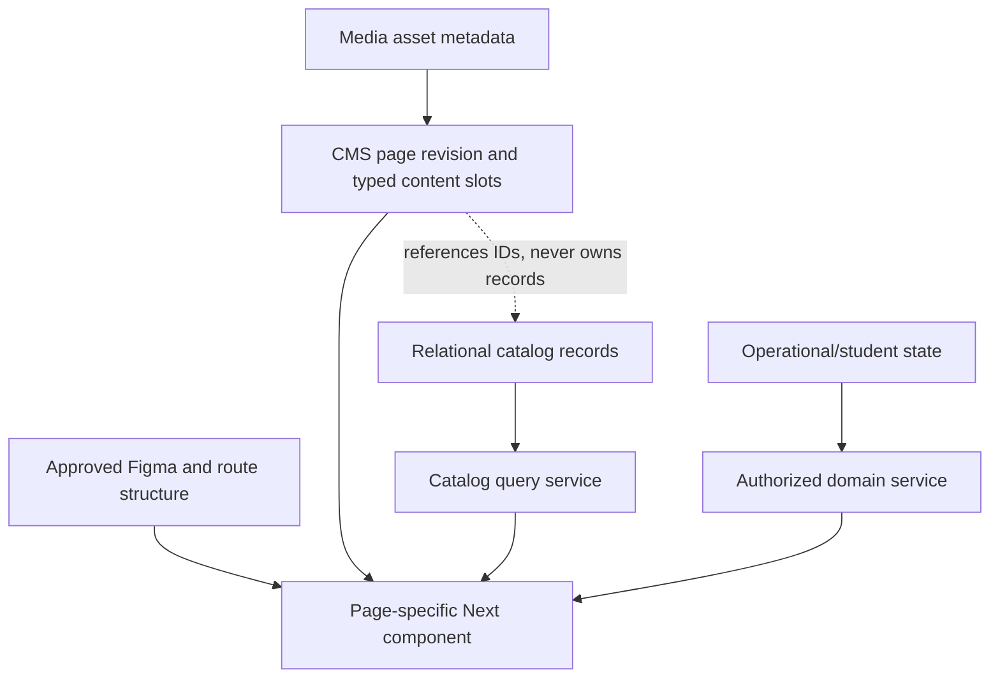

# CMS and catalog architecture

## Separation

CMS controls approved text/media/CTA/SEO/configuration slots. Code/Figma control layout. Catalog owns domain records. Operations owns students/leads/workflows. No universal content table or arbitrary page builder is introduced.

## Decision record: typed CMS separated from catalog and operations

| Field | Record |
|---|---|
| Context | PGS combines designed pages, editable content, relational catalog, and student operations. |
| Options | universal content/page-builder table; separate typed/revisioned CMS and relational domains |
| Decision | Preserve four-layer separation; CMS owns approved slots, catalog/operations own normalized records, code/Figma own layout. |
| Why | Prevents layout drift, data duplication, and authorization leakage through content JSON. |
| Tradeoffs | More domain-specific editors/schemas than a generic builder. |
| Existing evidence | `cms_pages`/revisions, relational catalog tables, page-specific current/legacy renderers. |
| Reference evidence | typed CMS and resource separation patterns; owner product authority. |
| Reversibility | Content schemas can version; merging authoritative domains into JSON would not be safely reversible. |
| Implementation phase | Existing model retained; new presentation schemas blocked by Figma. |

## CMS domains

| Domain | Current authority | Target decision |
|---|---|---|
| pages/revisions/SEO/Open Graph | `cms_pages`, `cms_page_revisions` | KEEP; page-type schema registry validates versioned content |
| proof `page_content` | migration 001 proof | DEPRECATE only after row/route reconciliation and owner approval |
| media | `media_assets`, marketing/CMS preview buckets | KEEP; asset lifecycle/usage references later |
| popups | page revisions/settings where typed | define typed popup configuration only after Figma Popup access |
| FAQs/testimonials/highlights/articles/people | corresponding structured tables | KEEP |
| resources/dates/deadlines/facts/stats | corresponding structured tables | KEEP |
| Weekly Wall/feed content | `weekly_wall_items`, articles/highlights where mapped | KEEP domains distinct; no invented merge |
| legal/social/notices/marquee | `legal_documents`, `site_social_links`, `site_notices` | KEEP |
| Premium marketing config | `premium_content_settings` | KEEP; entitlement state remains outside CMS |

Rich text is allowed only in named schema fields whose presentation supports it. Stored schema/version, sanitizer/render policy, link/media allowlist, migration, and plain-text fallback are required before Tiptap adoption.

## Catalog domains

| Domain | Current normalized model | Target |
|---|---|---|
| countries/destinations | `countries` | KEEP; reconcile `dial_code`/`country_list` legacy data |
| universities | `universities` → country/media/filter joins | KEEP |
| programs | `programs` → university/media/tags/filters | KEEP |
| course categories/courses | `course_categories`, `courses` | KEEP |
| event categories/events/facilitators | `event_categories`, `events`, `event_facilitators` | KEEP |
| tags | `catalog_tags` plus entity joins | KEEP; bounded `tag_type` vocabulary |
| filters | facets/options plus entity joins | KEEP; typed entity scope and indexed joins |
| university meeting slots | `university_meeting_slots` | KEEP as structured content/catalog relationship |

Do not collapse programs/courses/events/universities into one `content` or generic object table: publication rules, fields, relations, detail queries, and student saves differ.

## Publication contract

- Draft read requires domain read permission.
- Manage creates/updates relational record or CMS revision.
- Publish is a separate permission/operation and validates all required relationships/media/schema.
- Public RLS exposes only published records/revisions.
- Publication creates audit and domain events; cache invalidation consumes the event.
- Preview is an authorized presentation mode, never a public data bypass.

## Search/index contract

Published catalog search uses Postgres generated/search vectors or trigram indexes plus structured filters. Draft/internal search adds permission predicates first. CMS search indexes approved text fields and revision status, not arbitrary JSON serialization.

## Presentation gate

No page schema, popup composition, slot order, CTA, or layout is inferred while PGS Flow/Figma V6/V6 Popup are inaccessible. Existing typed schemas may continue; new presentation-dependent schemas are **BLOCKED — FIGMA ACCESS REQUIRED**.
