# Migration strategy

Migrations 001–009 are immutable. Phase 2 creates no migration. The names below are sequencing contracts; actual migration filenames are created only in the authorized implementation phase and start at 010.

## Expand, reconcile, cut over, contract

```mermaid
flowchart LR
  B["Backup and immutable baseline"] --> E["Expand schema and compatibility"]
  E --> P["Profile source data and backfill staging"]
  P --> V["Validate counts, constraints, RLS, lineage"]
  V --> D["Dual-read or compatibility view"]
  D --> C["Cut over server domain services"]
  C --> O["Observe and reconcile"]
  O --> X["Contract/deprecate only with approval"]
```

## Recommended migration sequence

| Sequence | Scope | Preconditions | Rollback/compatibility |
|---|---|---|---|
| 010 | clean-document access gate and security transition helpers/policies | historical object scan/reconciliation plan; coordinated server signer change | deny-by-default; compatibility report for inaccessible pending files |
| 011 | `read_only_staff` role, canonical permission catalog, helper compatibility | role fixture matrix; TypeScript/DB mapping plan | retain old `viewer` alias/assignments until verified |
| 012 | canonical `audit_events`/`domain_events` foundations and notification linkage | redaction/retention/event vocabulary approval | preserve original audit tables read-only with lineage |
| 013 | document records/versions/reviews/previews/upload sessions and status separation | owner workflow/retention/file policy decisions; scanner architecture | expand/backfill; compatibility view/API for old `student_documents` shape |
| 014 | Viewer relationship/invitation/grants/shares | Viewer grant/consent/expiry/download decisions; document records available | feature disabled by default; rows removable before activation |
| 015 | canonical leads and source/notes/conversion links | lead status/matching/retention decisions | source tables remain authoritative during reconciliation |
| 016+ | KPI views/snapshots, search adapters/indexes, delivery tables | approved metric/search/channel contracts and performance plans | drop new indexes/views or disable projectors without source loss |

Sequence may be split into smaller migrations; dependency order and immutable 001–009 rule do not change. Schema and server changes with security implications deploy atomically or deny safely.

## Document backfill

1. Inventory every current `student_documents` row and Storage object without exposing content.
2. Group versions deterministically by requirement/student; create one logical record per proven group.
3. Map `qc_status` to target workflow and current `scan_status` to security state without promoting `pending` to `clean`.
4. Create initial review history from reviewer/time/note where present.
5. Scan/reconcile existing objects through the approved service. Missing/mismatched/failed objects remain quarantined/inaccessible.
6. Set current version only through verified rules; reconcile requirement fulfillment.
7. Compare row/object/hash/count exception reports; owner/security disposition exceptions.
8. Cut server APIs to new services, then later retire compatibility fields/views.

## Role backfill

- insert `read_only_staff` role and canonical permissions;
- copy active/revoked history with assignment lineage rather than rewriting old records;
- update DB helpers/order and server maps under tests;
- verify each actor fixture; stop issuing old role;
- retire alias only after no active dependency remains.

## Legacy import rules

Legacy data enters a restricted staging schema, never production targets directly. Create deterministic legacy-ID maps; exclude passwords/reset tokens; profile nulls/duplicates/encoding/orphans/status/path/media; quarantine files; validate feature counts and checksums; preserve source lineage; enable/test RLS before exposure; purge staging credentials/data per retention. Dormant/deprecated concepts are not imported by default.

## Required migration evidence

- forward and rollback/disable plan;
- schema/constraint/index/RLS review;
- synthetic and sanitized reconciliation fixtures;
- source-to-target counts, exceptions, and lineage;
- runtime pgTAP across all actors/states;
- application compatibility tests and deployment order;
- performance query plans before/after;
- no false “passed” label for Docker/role/deployment-gated checks.
