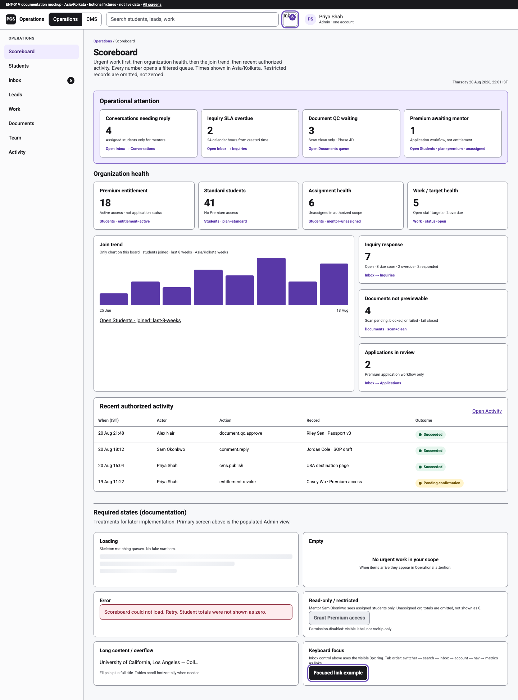
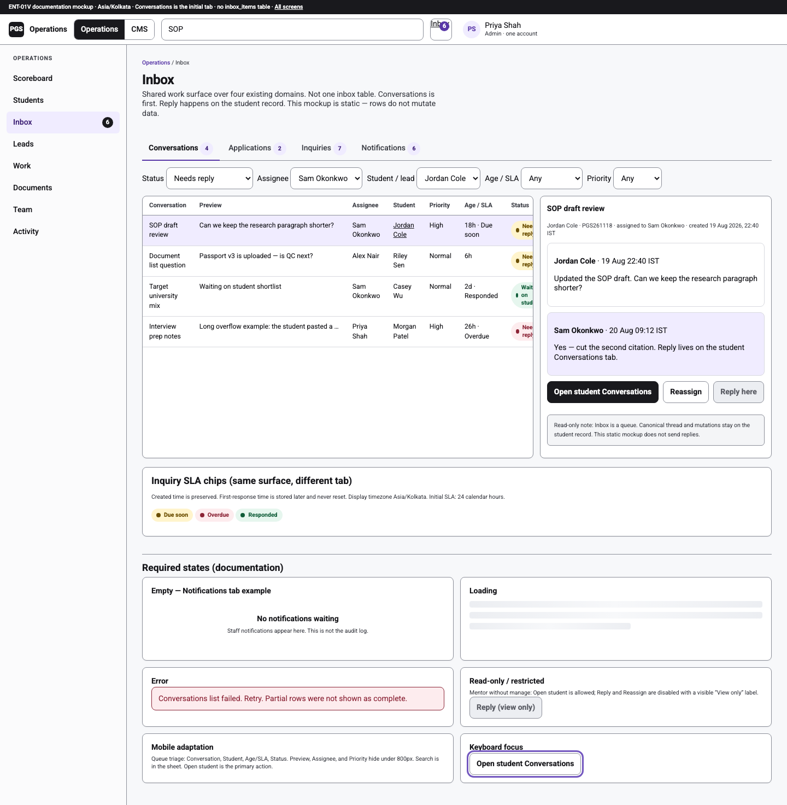
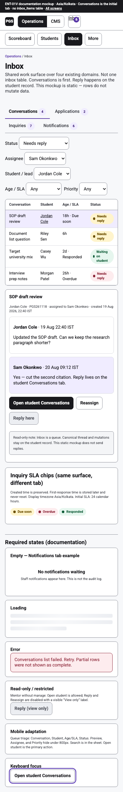
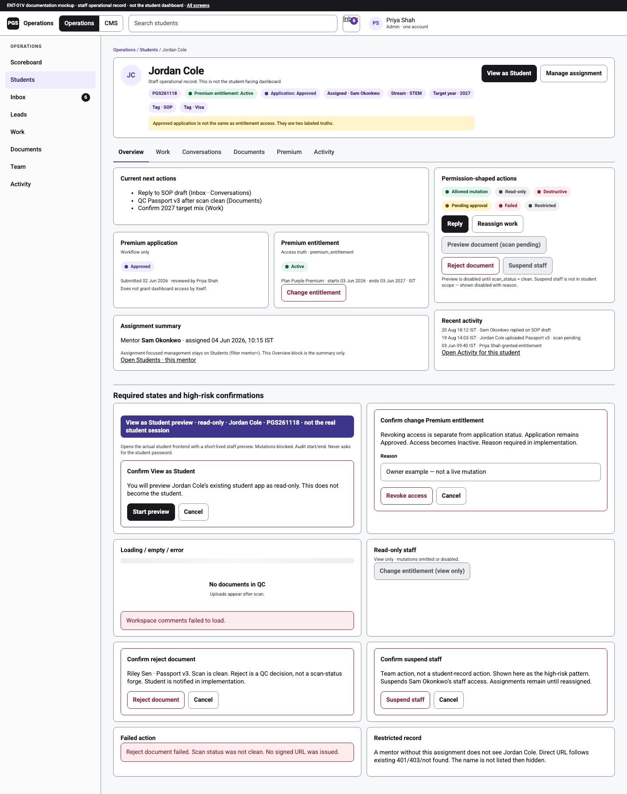
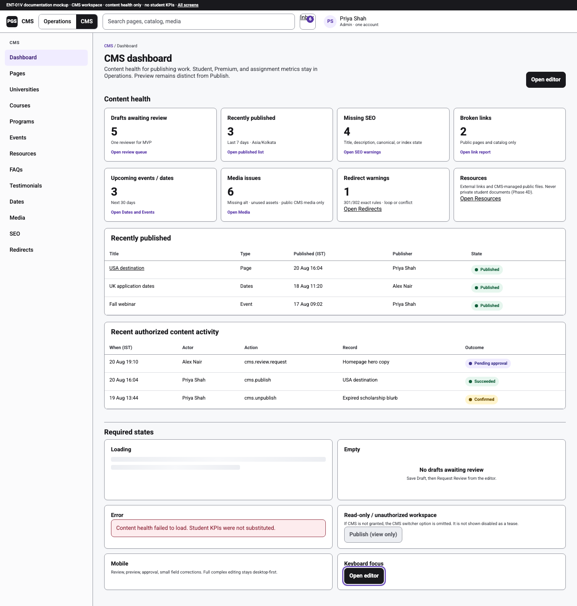
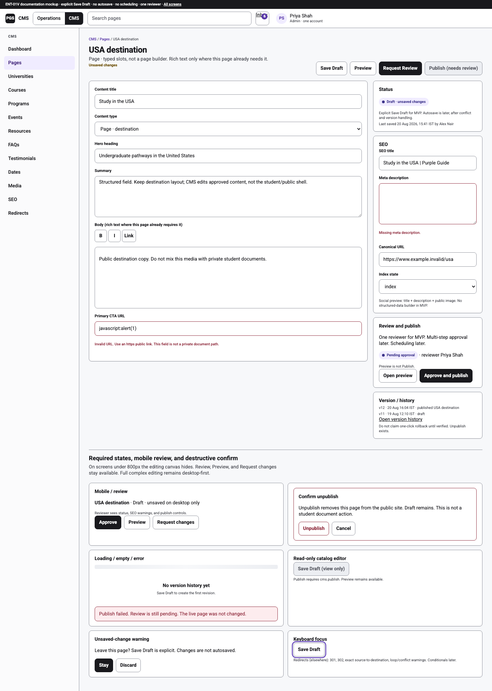
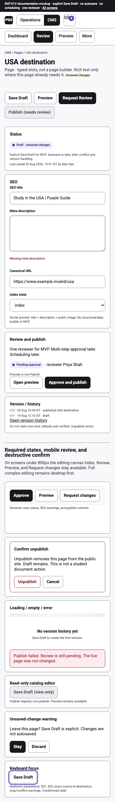

# ENT-01V — Owner visual review

Status: **stop for visual approval**. These are static documentation mockups. They are not application routes, not connected to Auth, APIs, or Supabase, and not a start of ENT-02.

Open locally:

- Index: [`ent-01v-mockups/index.html`](ent-01v-mockups/index.html)
- Absolute: `/Users/24potatoes/Documents/GitHub/pgs-v3-enterprise-ops-cms/docs/pgs-v3-implementation/ent-01v-mockups/index.html`

Fixtures are fictional: Priya Shah (Admin), Jordan Cole `PGS261118`, Sam Okonkwo, Riley Sen, Alex Nair, Casey Wu, Morgan Patel. No real personal data.

Timezone shown: **Asia/Kolkata**.

---

## BEFORE → AFTER

**BEFORE (current V3 staff chrome)**

```
One /admin shell
Nav: Scoreboard · Students · Targets · Team · Notifications · Activity
CMS lives under /admin/content/*  (/cms redirects to pages)
Comments and document QC only inside a student record
Scoreboard = student counts + limited attention
No workspace switcher
```

**AFTER (these mockups)**

```
Same staff identity, one account menu
Header workspace switcher: Operations | CMS (authorized only)
Ops nav: Scoreboard · Students · Inbox · Leads · Work · Documents · Team · Activity
CMS nav: Dashboard · Pages · catalog · Resources · FAQs · Testimonials · Dates · Media · SEO · Redirects
Inbox unifies four queues without one inbox table
Student detail is a staff operational record
CMS dashboard is content health only
CMS editor = main canvas + right Status / SEO / Review / Publish
```

These screens propose the **look and interaction**. They do not implement routes, permissions, or schema.

---

## Screenshots

| Screen | File |
|---|---|
| Operations Scoreboard desktop | [](ent-01v-mockups/screenshots/operations-scoreboard-desktop.png) |
| Operations Inbox desktop | [](ent-01v-mockups/screenshots/operations-inbox-desktop.png) |
| Operations Inbox mobile | [](ent-01v-mockups/screenshots/operations-inbox-mobile.png) |
| Student detail desktop | [](ent-01v-mockups/screenshots/student-detail-desktop.png) |
| CMS Dashboard desktop | [](ent-01v-mockups/screenshots/cms-dashboard-desktop.png) |
| CMS Content Editor desktop | [](ent-01v-mockups/screenshots/cms-content-editor-desktop.png) |
| CMS Content Editor mobile / review | [](ent-01v-mockups/screenshots/cms-content-editor-mobile.png) |

Absolute screenshot folder: `/Users/24potatoes/Documents/GitHub/pgs-v3-enterprise-ops-cms/docs/pgs-v3-implementation/ent-01v-mockups/screenshots/`

HTML sources:

- [`operations-scoreboard.html`](ent-01v-mockups/operations-scoreboard.html)
- [`operations-inbox.html`](ent-01v-mockups/operations-inbox.html)
- [`student-detail.html`](ent-01v-mockups/student-detail.html)
- [`cms-dashboard.html`](ent-01v-mockups/cms-dashboard.html)
- [`cms-content-editor.html`](ent-01v-mockups/cms-content-editor.html)

Each HTML file includes a **Required states** strip: loading, empty, error, read-only/restricted, overflow, keyboard focus. Mobile adaptation is in the two mobile screenshots plus notes on the desktop pages.

---

## Operations Scoreboard

**Purpose:** Staff landing for “what needs me now,” then organization health, then the only chart (join trend), then recent authorized activity.

**Main interactions:** Every metric is a link to a filtered queue (Inbox, Students, Documents, Work, Activity). Search, Inbox badge, workspace switcher, and one user menu sit in the header.

**Reused V3:** Scoreboard idea, staff search pattern, activity as `audit_events`, Premium vs Standard as entitlement truth, mentor-assigned scope for restricted actors, Asia/Kolkata timestamps.

**New proposed:** Header switcher; eight-item Ops nav; Operational Attention band; Inquiry SLA overdue; Documents QC waiting; Conversations needing reply; Applications in review as workflow (not access); join trend as the only chart; drill-down copy on every card.

**Permissions:** Admin mock shows org-scope numbers. Restricted/mentor treatment is in the states strip: unassigned org totals are omitted, not shown as zero. Grant Premium is disabled without `premium.manage`.

**Mobile:** Horizontal ops chips; cards stack; search hides (available in a later sheet). Not screenshotted separately; Inbox mobile is the Ops triage proof.

---

## Operations Inbox

**Purpose:** Shared queue over four domains. Conversations is the first tab. Split list + detail on desktop.

**Main interactions:** Tabs Conversations / Applications / Inquiries / Notifications. Filters for status, assignee, student/lead, age/SLA, priority. Row opens a read-only preview. Primary action is **Open student Conversations**. Reply is disabled on the queue (“Reply here”) with an explicit read-only note. Reassign is shown as a permitted mutation on the queue only as a mock control.

**Reused V3:** `workspace_comments` as the conversation truth; staff notifications; leads as inquiries; no `inbox_items` table.

**New proposed:** Four-tab chrome; Conversations-first; SLA chips Due soon / Overdue / Responded (24 calendar hours from created time; first-response stored later and never reset); Applications tab for Premium **application** workflow.

**Permissions:** Mentor sees assigned students only. View-only staff: Open is allowed; Reply/Reassign disabled with “View only”.

**Mobile:** Conversation, Student, Age/SLA, Status remain. Preview, Assignee, and Priority columns hide. Queue triage → open student. Screenshot: `operations-inbox-mobile.png`.

---

## Student detail

**Purpose:** Staff operational record for one student. Not a recreation of the student dashboard.

**Main interactions:** Identity + PGS code + entitlement + application + assignment + tags + stream + target year. Tabs: Overview / Work / Conversations / Documents / Premium / Activity. Overview holds assignment summary and next actions. **View as Student** uses a confirmation and a distinct preview banner. Premium application and Premium entitlement are two labeled blocks. Destructive actions use a confirm pattern.

**Reused V3:** Same student identity (`profiles`), `mentor_assignments`, `premium_entitlement`, Phase 4D document fail-closed unless `scan_status = clean`, View as Student as the real student app + read-only preview (not a fake copy).

**New proposed:** Locked tab order; assignment summary on Overview (assignment management remains on Students); two Premium truths visually separated; permission-shaped action legend.

**Permissions:** Preview document disabled until scan is clean. Change entitlement requires `premium.manage` and confirmation. Suspend staff is a Team pattern, not a student-row action (shown as a high-risk confirm example). Restricted actors never receive the row.

**Mobile:** Tabs become a select/stack in implementation. Desktop is the visual authority for the record header.

---

## CMS Dashboard

**Purpose:** Content health only. No student, Premium, or assignment KPIs.

**Main interactions:** Cards drill to review queue, published list, SEO warnings, link report, dates/events, media, redirects, resources. Tables for recently published and content audit. Workspace switcher shows CMS selected. Same user menu. Inbox badge still deep-links to Operations Inbox when the actor has Ops.

**Reused V3:** Typed pages/catalog, publish/unpublish, media assets, audit events for content.

**New proposed:** CMS as a workspace; dashboard widgets; Resources as links **and** public CMS files (never Phase 4D student files); Redirects 301/302 with loop/conflict warning; SEO missing-field count.

**Permissions:** If CMS is not granted, the CMS switcher option is omitted (not shown disabled). Publish disabled for view-only.

**Mobile:** Review / preview / approval / small corrections. Full editing stays desktop-first.

---

## CMS editor

**Purpose:** Edit a typed page without hiding the editor behind many top-level tabs.

**Main interactions:** Main canvas (title, type, structured fields, rich text where this page already needs it). Right panel: Status, SEO, Review and Publish, Version/history. **Save Draft**, **Preview**, **Request Review**. Publish stays disabled until review. Unsaved-change indicator. Validation errors on CTA URL and meta description. Preview is not Publish. No autosave, no scheduling, no multi-step approval.

**Reused V3:** Explicit save/publish RPCs, Draft Mode preview, revision history (~30), unpublish, typed slots.

**New proposed:** Canvas + right rail; Request Review for one reviewer; unsaved warning; SEO fields (title, description, canonical, index/noindex, social preview note). No structured-data builder.

**Permissions:** `cms.manage` to edit; `cms.publish` to publish; view-only keeps Preview.

**Mobile / review:** Editing canvas hidden under 800px. Reviewer sees Status/SEO/Review plus Approve, Preview, Request changes. Screenshot: `cms-content-editor-mobile.png`.

---

## Mobile behavior (summary)

| Surface | Mobile does | Mobile does not |
|---|---|---|
| Operations | Queue triage, search/filter (sheet later), open student/lead, basic safe actions, reply/reassign where permitted | Dense 12-column tables at tiny type |
| CMS | Review, preview, approval, small field corrections | Full complex page editing |

---

## Accessibility review

FIGMA ACCESSIBILITY ADAPTATION (internal tools; Operations tokens):

```
ORIGINAL: --ops-muted #696b74 on #f7f8fa / #fff
ISSUE: fails WCAG 2.2 AA normal text (4.5:1)
PGS IMPLEMENTATION: --muted #3f4148
```

```
ORIGINAL: --ops-line #e3e4e8 as the only panel edge
ISSUE: hairline gray is below 3:1 non-text contrast for grouping
PGS IMPLEMENTATION: panel borders #8c8f99; internal row rules remain lighter
```

Postflight for these **static** mockups (not the live app):

- Semantic HTML: PASS (header, nav, main, tables with `scope`, labels)
- Accessible names: PASS (search, inbox badge, account menu, icon-adjacent controls named)
- Contrast: PASS for body/muted/purple-on-white/danger-on-danger-bg (programmatic check in this batch)
- Keyboard: PASS as documented (visible 3px `#7357bf` ring; no `tabindex > 0`)
- Focus: PASS (demo rings on each screen)
- Forms/labels: PASS on editor and inbox filters
- Zoom/reflow: PASS intent (flex wrap, stacked grids under 800px). 200% not separately screenshotted
- Automated accessibility scan: NOT RUN (no mockup Playwright axe job added; tidy HTML check only)

Status is never color-only: label + dot. `prefers-reduced-motion` disables animation.

---

## Security-sensitive UX (shown)

| Pattern | Where |
|---|---|
| Read-only action | Inbox “Reply here” disabled; view-only buttons |
| Allowed mutation | Reply, Reassign, Save Draft, Request Review |
| Destructive mutation | Reject document, Change entitlement, Unpublish, Suspend staff — each with confirm |
| Permission-disabled | Grey button + visible reason, not tooltip-only |
| Pending approval | CMS review; entitlement revoke pending in activity |
| Failed action | Reject document when scan is not clean |
| Restricted record | Mentor without assignment never sees the student |
| View as Student preview | Distinct purple banner + confirm; not the real session |
| Premium application vs entitlement | Two blocks; Approved ≠ Active access |
| Document fail-closed | Preview disabled until scan clean |

---

## Known limitations

- Static HTML/CSS only. Controls do not save, publish, or query data.
- Roboto is requested, then Arial/Helvetica. No Google Fonts CDN.
- Inbox Applications tab is a planned surface; V3 still has no application-history table.
- Lead SLA first-response column is display policy only until schema exists.
- Request Review is UX, not a table yet.
- ClamAV is not claimed. Document copy says scan clean / Phase 4D.
- Autosave, scheduled publish, multi-step approval, conditional redirects, and structured-data controls are **not** in these mockups.
- Workspace switcher in this Admin fixture shows both workspaces. Unauthorized names would be omitted in implementation.
- Screenshot full-page captures include the documentation “Required states” strips on purpose.
- Automatic Vercel Preview of the branch may occur; these files are not public app routes.

---

## Exact owner decisions requested

Locked architecture decisions are **not** reopened. Please approve or mark changes to the **visual contract**:

1. Scoreboard hierarchy: Attention → organization health → join trend (only chart) → activity. Yes / adjust.
2. Inbox: Conversations first, split list/detail, reply on the student record. Yes / adjust.
3. Student detail as a staff record (not a student dashboard clone), with the six tabs and two Premium blocks. Yes / adjust.
4. CMS dashboard: content health only. Yes / adjust.
5. CMS editor: canvas + right Status/SEO/Review/Publish; explicit Save Draft; Preview ≠ Publish. Yes / adjust.
6. Mobile: Ops = triage; CMS = review-first, canvas hidden. Yes / adjust.
7. Visual GO AHEAD for this ENT-01V contract (still **not** ENT-02 / application implementation).

Reply with visual notes (spacing, density, labels) if something should change before any product code.

---

## What not to do next

Do not start ENT-02, ENT-03, or SEC-01 from this document. Do not merge. Do not change GitHub settings, Supabase, Production, or the student restoration branch.
